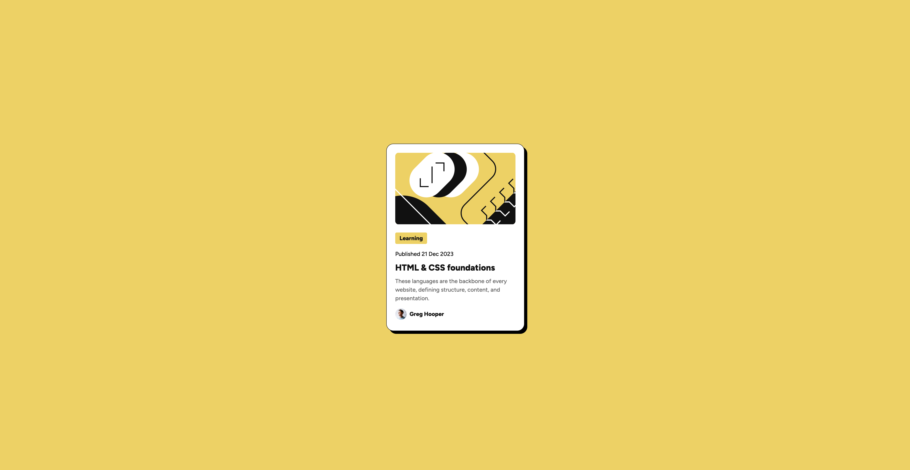
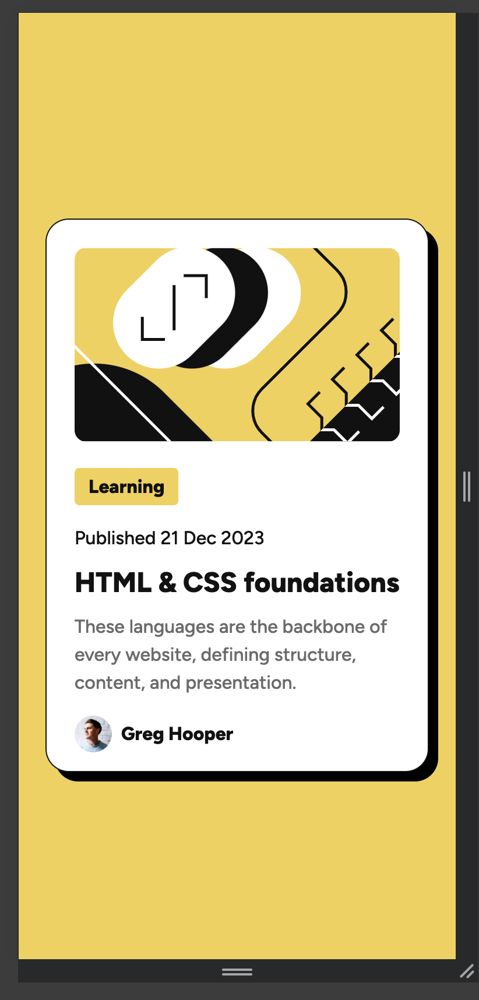

# Frontend Mentor - Blog preview card solution

This is a solution to the [Blog preview card challenge on Frontend Mentor](https://www.frontendmentor.io/challenges/blog-preview-card-ckPaj01IcS). Frontend Mentor challenges help you improve your coding skills by building realistic projects.

## Table of contents

- [Overview](#overview)
  - [The challenge](#the-challenge)
  - [Screenshot](#screenshot)
  - [Links](#links)
- [My process](#my-process)
  - [Built with](#built-with)
  - [What I learned](#what-i-learned)
  - [Continued development](#continued-development)
- [Author](#author)

## Overview

### The challenge

Users should be able to:

- See hover and focus states for all interactive elements on the page

### Screenshot

### Links

- Solution URL: [Vercel](https://project-blog-preview.vercel.app/)

## My process

I used Figma as a reference for style values, converted px to rem and stylized html accordingly. Then I figured out how to make the layout responsive.

### Built with

- Flexbox
- Figma
- Chrome device toolbar

### What I learned

I learned to use font-face in my project, improved my flexbox knowledge and, most importantly, learned how to make the layout responsive with @media and max width calculation using calc().

### Continued development

I would like to enhance my knowledge of responsive design and make the code look cleaner, as my CSS file looks like a mess.

## Author

- Frontend Mentor - [@yarsvent](https://www.frontendmentor.io/profile/yarsvent)
